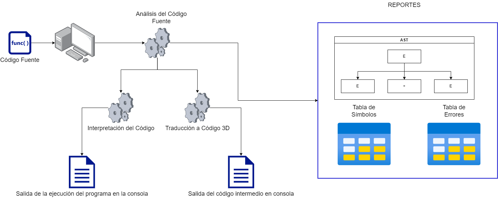

# Organizacion de computadoras y lenguajes 2
<h1 align="center">
  <br>
  <a></a>
  <br>
Quetzal
  <br>
</h1>

<h4 align="justify">Quetzal es un lenguaje de programación inspirado en C, su característica principal es la inclusión de tipos implícitos. El sistema de tipos de Quetzal realiza una formalización de los tipos de C y Java. Esto permite a los desarrolladores definir variables y funciones tipadas sin perder la esencia. Otra inclusión importante de Quetzal es la simplificación de los lenguajes C y Java para poder realizar diferentes instrucciones en menos pasos.
</h4>

[](https://nodesource.com/products/nsolid)

[](https://travis-ci.org/joemccann/dillinger)
[](https://github.com/Hcastleon/OLC2_VCD_PY1/issues)
[](https://lbesson.mit-license.org/)

## Tabla de Contenido
1. [Instalar](#instrucciones)
3. [¿Como funciona?](#detalle)
    1. [Flujo del programa](#flujo)
4. [Licencia](#licencia)
5. [Autor](#autor)

### Instalar <a name="instrucciones"></a>
Si no se desea instalar diritege a la pagina [Quetzal](https://hcastleon.github.io/OLC2_VCD_PY1/)

Para clonar esta aplicacion necesitas tener instalado [Git](https://git-scm.com)

```bash
# Clonar el repositorio
$ git https://github.com/Hcastleon/OLC2_VCD_PY1
# Entrar a la carpeta
$ cd OLC2_VCD_PY1
# Ejecutar el html
$ index.html
```

Nota: Para ejecutar el proyecto es necesario tener instaladas los paquetes necesarios.

### ¿Como funciona? <a name="detalle"></a>
La aplicacion realiza tres tipos de analisis al codigo de Alto nivel
> * <b>Lexico</b> Que todos los simbolos de la entrada esten en nuestros simbolos permitidos
> * <b>Sintactico</b> Que la estructura sea correcta
> * <b>Semantico</b> Que tenga coherencia el codigo a ejecutar
Si no se encuentra ningun error se procede a realizar la traduccion a Tres Direcciones.
<br/>
En tres direcciones se permite
> * <b>Ejecutar</b> Se ejecuta el codigo tres direcciones realizando los mismos analisis que para el lenguaje de alto nivel

La aplicacion cuenta con cuatro tipos de reportes que ayudan al analisis de sus funciones de ejecucion.
> * <b>Tabla de simbolos</b> Este reporte mostrará la tabla de símbolos después de la ejecución del archivo. Se muestran las variables, funciones y procedimientos que fueron declarados, así como su tipo y toda la información que el estudiante considere necesaria.
> * <b>AST</b> Este reporte mostrara el árbol de análisis sintáctico que se produjo al analizar el archivo de entrada.
> * <b>Reporte de errores</b> Todos los errores que se recolectan durante el analisis,  se muestran un reporte de errores.
> * <b>Reporte gramatical</b> En este reporte se muestra la definición dirigida por la sintaxis, indicando que expresiones se utilizaron, precedencia, símbolos terminales y no terminales, y las reglas semánticas.
Si no se encuentra ningun error se procede a realizar la traduccion a Tres Direcciones.

#### Flujo <a name="flujo"></a>


### Licencia <a name="licencia"></a>
[](https://lbesson.mit-license.org/)

- **[MIT license](http://opensource.org/licenses/mit-license.php)**

### Autor <a name="autor"></a>
#### Datos Estudiantes
| Nombre | Carné |
| ------ | ------ |
| Heidy Carolina Castellanos de León | 201612282 |
| Byron Antonio Alvares Morales  | 201612185 |
